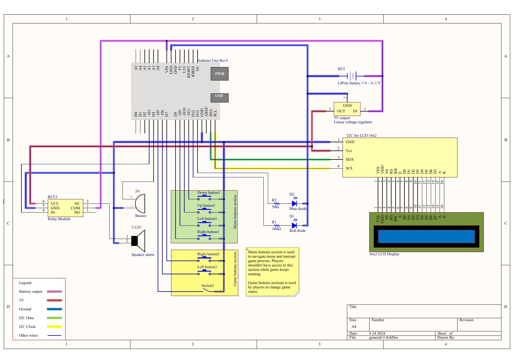

# MilitaryGamesTimer

The device allows you to conduct military games as ASG or LARP. The device offers two game modes: inspired Battlefield video game Domination and bomb plant/defuse. Each game mode has multiple modifiers.

The electrical diagram and user manual (only in Polish) can be found in the "dosc" directory.

The device is based on the Arduino Uno controller.

<h2>General photo:</h2>

<h2>Electric diagram::</h2>

